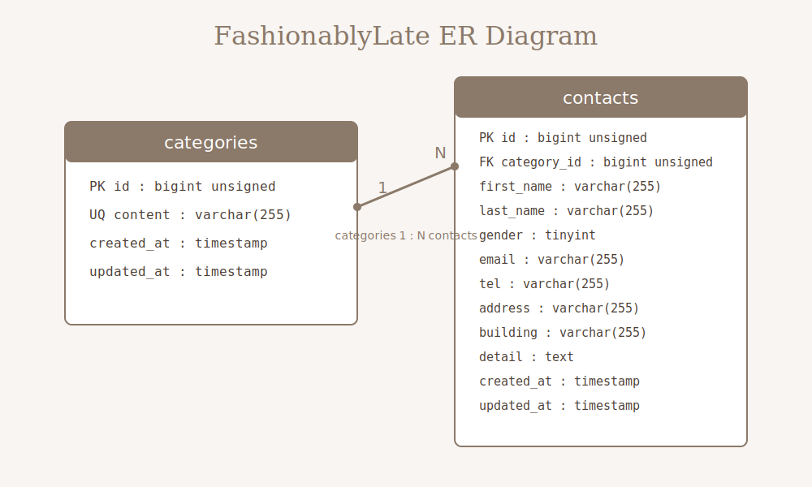

# FashionablyLate

## 環境構築

### Dockerビルド

1. リポジトリをクローンする

```bash
git clone https://github.com/o1tan/fashionably-late.git
```

2. プロジェクトディレクトリへ移動する

```bash
cd fashionably-late
```

3. Dockerコンテナを作成・起動する

```bash
docker compose up -d --build
```

4. PHPコンテナに入る

```bash
docker compose exec php bash
```

5. Composerパッケージをインストールする

```bash
composer install
```

6. `.env.example` ファイルをコピーして `.env` を作成する

```bash
cp .env.example .env
```

7. `.env` の環境変数を変更する

```env
DB_CONNECTION=mysql
DB_HOST=mysql
DB_PORT=3306
DB_DATABASE=laravel_db
DB_USERNAME=laravel_user
DB_PASSWORD=laravel_pass
```

8. アプリケーションキーを作成する

```bash
php artisan key:generate
```

9. マイグレーションを実行する

```bash
php artisan migrate
```

10. シーディングを実行する

```bash
php artisan db:seed
```

11. 権限エラーが出る場合は、以下を実行する

```bash
chmod -R 777 storage bootstrap/cache
```

## 使用技術

* PHP 8.1.34
* Laravel 8.83.8
* MySQL 8.0.26
* nginx 1.21.1
* phpMyAdmin

## URL

* 開発環境: http://localhost:81
* phpMyAdmin: http://localhost:8081

## 実装機能

* お問い合わせ入力画面
* お問い合わせ確認画面
* お問い合わせ完了画面
* お問い合わせ内容のDB保存
* 管理画面
* お問い合わせ一覧表示
* ページネーション
* 検索機能
* 名前検索
* 性別検索
* メールアドレス検索
* お問い合わせ種類検索
* 日付検索
* 検索リセット機能
* 詳細モーダル表示
* お問い合わせ削除機能
* バリデーション機能

## バリデーション

### お問い合わせフォーム

* 姓: 必須、8文字以内
* 名: 必須、8文字以内
* 性別: 必須
* メールアドレス: 必須、メール形式
* 電話番号: 必須、半角数字、各入力欄5桁以内
* 住所: 必須
* 建物名: 任意
* お問い合わせの種類: 必須
* お問い合わせ内容: 必須、120文字以内

## テーブル設計

### categoriesテーブル

| カラム名       | 型               | PRIMARY KEY | UNIQUE KEY | NOT NULL | FOREIGN KEY |
| ---------- | --------------- | ----------- | ---------- | -------- | ----------- |
| id         | bigint unsigned | ○           |            | ○        |             |
| content    | varchar(255)    |             | ○          | ○        |             |
| created_at | timestamp       |             |            |          |             |
| updated_at | timestamp       |             |            |          |             |

### contactsテーブル

| カラム名        | 型               | PRIMARY KEY | UNIQUE KEY | NOT NULL | FOREIGN KEY    |
| ----------- | --------------- | ----------- | ---------- | -------- | -------------- |
| id          | bigint unsigned | ○           |            | ○        |                |
| category_id | bigint unsigned |             |            | ○        | categories(id) |
| first_name  | varchar(255)    |             |            | ○        |                |
| last_name   | varchar(255)    |             |            | ○        |                |
| gender      | tinyint         |             |            | ○        |                |
| email       | varchar(255)    |             |            | ○        |                |
| tel         | varchar(255)    |             |            | ○        |                |
| address     | varchar(255)    |             |            | ○        |                |
| building    | varchar(255)    |             |            |          |                |
| detail      | text            |             |            | ○        |                |
| created_at  | timestamp       |             |            |          |                |
| updated_at  | timestamp       |             |            |          |                |

## ER図


